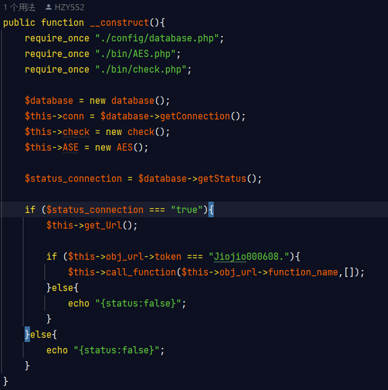

Interface API du programme Android

    
1. __Construct()

    
    
L'explication du code : 

    
 __construct() est une méthode spéciale appelée "constructeur" qui est utilisée pour initialiser des objets.  
         
        Le constructeur est automatiquement appelé lorsqu'un nouvel objet d'une classe est créé.  
         
        Il est généralement utilisé pour définir les valeurs initiales des propriétés de l'objet, 
        pour établir des connexions ou pour effectuer d'autres opérations de configuration.
    

    
L'exemple d'utilisation

    None

