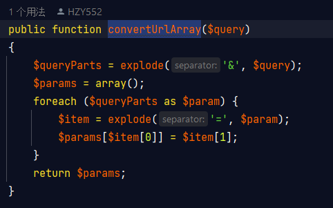
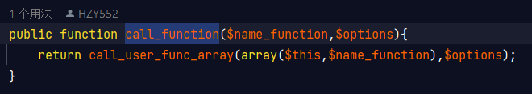
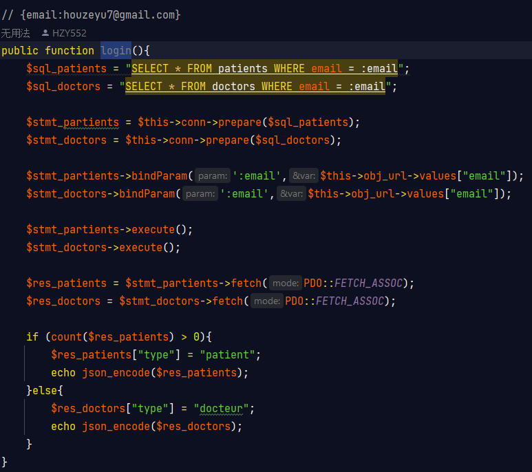
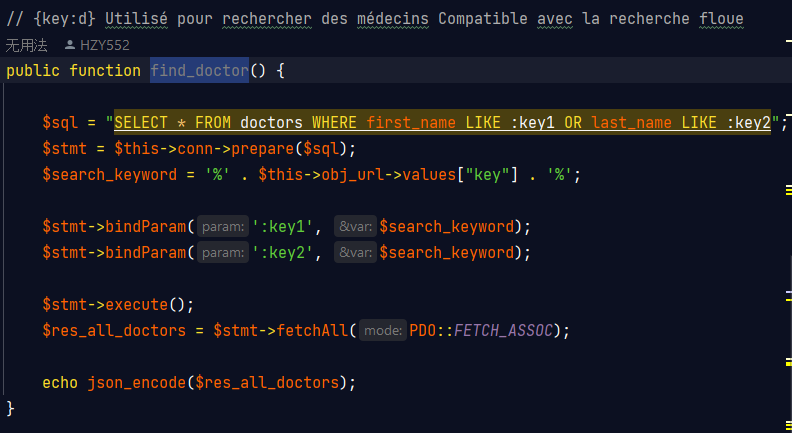

Interface API du programme Android

    
1. __Construct()

    
    
L'explication du code : 

    
 __construct() est une méthode spéciale appelée "constructeur" qui est utilisée pour initialiser des objets.  
         
        Le constructeur est automatiquement appelé lorsqu'un nouvel objet d'une classe est créé.  
         
        Il est généralement utilisé pour définir les valeurs initiales des propriétés de l'objet, 
        pour établir des connexions ou pour effectuer d'autres opérations de configuration.
    

    
L'exemple d'utilisation

    None
    

    
2. convertUrlArray()

    
    
L'explication du code : 

    
 Cette fonction convertUrlArray($query) prend en entrée une 
        chaîne de requête (query string) et la convertit en un tableau associatif (array) de paramètres.
    

    
L'exemple d'utilisation

    None

    
3. call_function()

    
    
L'explication du code : 

    
 Cette fonction est écrite en PHP et elle permet d'appeler une méthode d'un objet en utilisant le nom de la méthode comme une chaîne de caractères, ainsi que les options qui seront passées à la méthode.
         
         
        La fonction prend deux arguments:
         
         
        Le premier argument est une chaîne de caractères qui représente le nom de la méthode à appeler.
        Le deuxième argument est un tableau contenant les options à passer à la méthode.
        La fonction utilise la fonction PHP "call_user_func_array()" pour appeler la méthode de l'objet. Cette fonction prend deux arguments:
         
         
        Le premier argument est un tableau contenant l'objet et le nom de la méthode à appeler.
        Le deuxième argument est un tableau contenant les paramètres qui seront passés à la méthode.
        Dans ce cas, le tableau qui contient l'objet et le nom de la méthode est construit à l'aide de la fonction "array()", qui prend deux arguments:
         
         
        Le premier argument est l'objet lui-même, représenté ici par le mot clé "$this".
        Le deuxième argument est le nom de la méthode, représenté ici par la variable "$name_function".
        Ainsi, cette fonction permet d'appeler une méthode d'un objet en utilisant une chaîne de caractères comme nom de méthode et en passant des options à la méthode. Cela peut être utile pour rendre votre code plus flexible et réutilisable.
    

    
L'exemple d'utilisation

    None

    
4. login()

    
    
L'explication du code : 

    
 Cette fonction est écrite en PHP et elle gère le processus de connexion d'un utilisateur. Elle interroge deux tables de la base de données, "patients" et "doctors", pour vérifier si l'adresse e-mail fournie par l'utilisateur est associée à un compte dans l'une ou l'autre de ces tables.
         
         
        La fonction commence par définir deux requêtes SQL pour interroger les tables "patients" et "doctors". Les requêtes sont préparées en utilisant la méthode "prepare()" de l'objet PDO (PHP Data Objects). Cette méthode prépare la requête SQL pour l'exécution, ce qui permet d'utiliser des paramètres pour les valeurs de l'utilisateur (comme l'adresse e-mail) et ainsi éviter les injections SQL.
         
         
        Ensuite, la fonction associe la valeur de l'adresse e-mail de l'utilisateur au paramètre "email" des deux requêtes à l'aide de la méthode "bindParam()" de l'objet PDO. Cette méthode associe une variable à un paramètre de requête, ce qui permet d'exécuter la requête avec cette valeur.
         
         
        Les requêtes sont ensuite exécutées à l'aide de la méthode "execute()" de l'objet PDO. Les résultats des deux requêtes sont stockés dans deux variables, "$res_patients" et "$res_doctors", à l'aide de la méthode "fetch()" de l'objet PDO. Cette méthode récupère la première ligne de résultat de la requête sous forme de tableau associatif, ce qui permet d'accéder aux valeurs de chaque colonne de la table à l'aide de leur nom.
         
         
        Enfin, la fonction vérifie si le tableau "$res_patients" contient des valeurs, ce qui signifie qu'un utilisateur avec cette adresse e-mail est un patient. Si c'est le cas, la fonction ajoute une clé "type" avec la valeur "patient" au tableau "$res_patients" et renvoie ce tableau sous forme de JSON à l'aide de la fonction "json_encode()". Sinon, la fonction ajoute une clé "type" avec la valeur "docteur" au tableau "$res_doctors" et renvoie ce tableau sous forme de JSON à l'aide de la fonction "json_encode()". Cela permet d'indiquer à l'utilisateur s'il a été identifié en tant que patient ou médecin.
    

    
L'exemple d'utilisation

    Url : https://your_ip_local/api/api.php?
    function_name=login&
    table_name=null&
    token=Jiojio000608.&
    values={email:testgmail@gmail.com}

    
4. find_doctor()

    
    
L'explication du code : 

    
 Cette fonction est écrite en PHP et elle permet de rechercher des médecins dans la base de données en utilisant un mot-clé de recherche fourni par l'utilisateur.
         
         
        La fonction commence par définir une requête SQL qui sélectionne toutes les colonnes de la table "doctors" où le prénom ou le nom du médecin ressemble au mot-clé de recherche fourni par l'utilisateur. Les caractères "%" sont utilisés pour représenter des caractères génériques dans la requête, ce qui permet d'effectuer une recherche partielle.
         
         
        La requête est préparée en utilisant la méthode "prepare()" de l'objet PDO. La requête préparée permet d'utiliser des paramètres pour la valeur de la recherche, qui sont définis plus tard à l'aide de la méthode "bindParam()" de l'objet PDO.
         
         
        La fonction définit également une variable "$search_keyword" qui contient la valeur de recherche avec des caractères "%" avant et après, ce qui permet d'effectuer une recherche partielle.
         
         
        Ensuite, la fonction utilise la méthode "bindParam()" de l'objet PDO pour associer la variable "$search_keyword" aux paramètres ":key1" et ":key2" de la requête préparée.
         
         
        La requête est exécutée à l'aide de la méthode "execute()" de l'objet PDO. Les résultats de la requête sont stockés dans une variable "$res_all_doctors" à l'aide de la méthode "fetchAll()" de l'objet PDO. Cette méthode récupère tous les résultats de la requête sous forme de tableau associatif.
         
         
        Enfin, la fonction renvoie les résultats sous forme de JSON à l'aide de la fonction "json_encode()". Cela permet d'envoyer les résultats au client de l'application sous forme de chaîne JSON, qui peut être facilement traitée et affichée dans le navigateur ou dans une application mobile.
    

    
L'exemple d'utilisation

    Url : https://your_ip_local/api/api.php?
    function_name=find_doctor&
    table_name=null&
    token=Jiojio000608.&
    values={key:your_key} 
    
    //{key:hou}  
    //Trouver tous les médecins 
    dont le prénom ou le nom contient "hou" 
    dans la base de données

